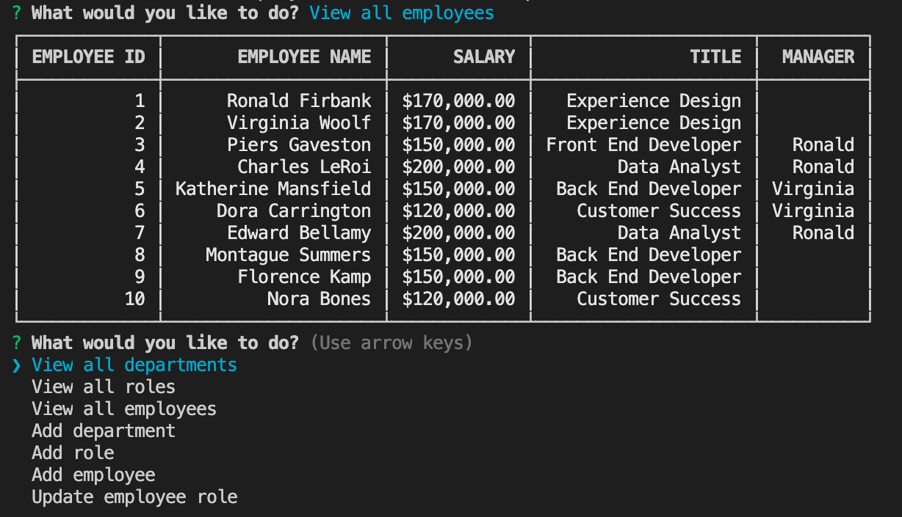

# Employee Tracker
[How to use the employee tracker](https://drive.google.com/file/d/1xdbBBxCPM4yGzusuddJhl97aXzLbQH81/view)

## Description

Powered by Node.js, Inquirer, and MySQL, Employee Tracker is a a CLI application that allows business owners to view and manage their company departments, roles, and employees.

Because this application won’t be deployed, you’ll also need to create a walkthrough video that demonstrates its functionality and all of the following acceptance criteria being met. You’ll need to submit a link to the video and add it to the README of your project.
Features includes:
- View all company departments
- View all company roles and the departments they are in
- View all employees, their role, salary and manager
- Add new departments
- Add new roles
- Add new employee
- Update employee roles
WHEN I choose to view all departments

## Table of Contents

- [Installation](#installation)
- [Usage](#usage)
- [Credits](#credits)
- [License](#license)
- [Contributing](#contributing)
- [Questions](#questions)

## Installation

To install this application, you'll need Git and Node.js installed on your computer. From the command line:

1. Clone this repository: `git@github.com:flokamp/employee-tracker.git`
2. Go to the root directory and install dependencies: `npm install`

## Usage

To run this application,
1. Enter `node server` in the command line
2. Select a prompt to view or update the database

## License

## Contributing

Feel free to send pull requests and raise issues.

## Questions

My GitHub: [flokamp](https://github.com/flokamp)

If you have additional questions, email me! kampflo2@gmail.com
